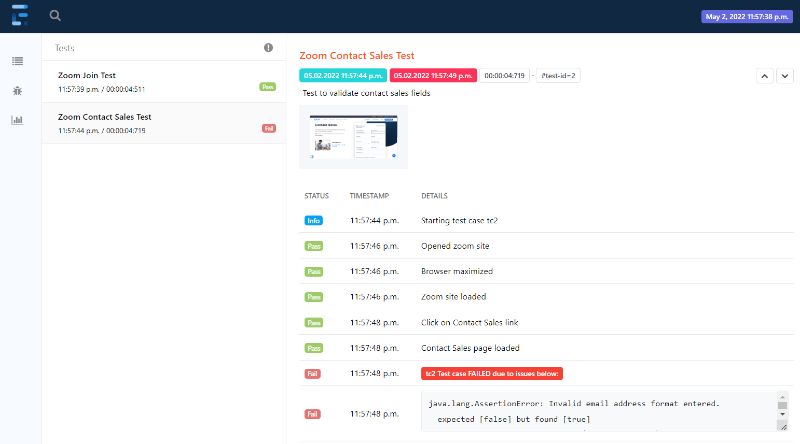

### Exercise on using Extent as a reporting framework
A simple implementation of using Extent as a reporting framework.
In this version, each action is logged as a step in a test case.

Run testing.xml to execute the test suite.
Alternatively, each test case can be executed independently.

This will generate the report file extentReport.html after the test suite execution.
This will also generate a screenshot file (with a PNG extension), if a test case fails.

Note that test case #2 has been intentionally set to fail at the email entry, to showcase the screen capture exercise.

View the report file extentReport.html in a browser.
  

**Dependencies:**
TestNG, Selenium, WebDriverManager, Extent

